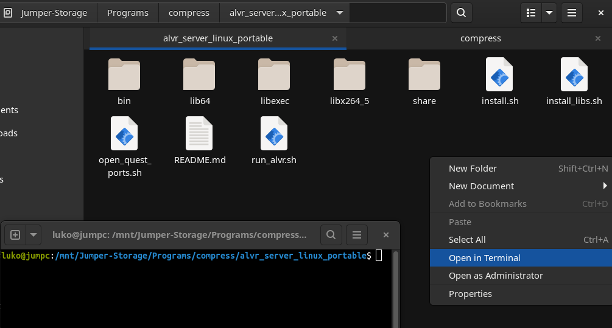

# Linux ALVR port is working now, just download, extract and run

## Basic Run

1. Have ONLY steam RUNTIME and steamVr installed (Flatpak not working and Native from Manjaro is problematic)

2. Install [SteamVr](https://store.steampowered.com/app/250820/SteamVR/) on Steam

3. [Download](https://github.com/alvr-org/ALVR/releases) and extract files here of the `alvr_server_linux_portable.tar.gz` 

4. Run `./run_alvr.sh` in the root path of these files

 

## Tips

- Your GPU may crash when starting streaming, just restart and try again

- Wayland can be more stable, but you can't acess your screen.

- Audio stream is not ready